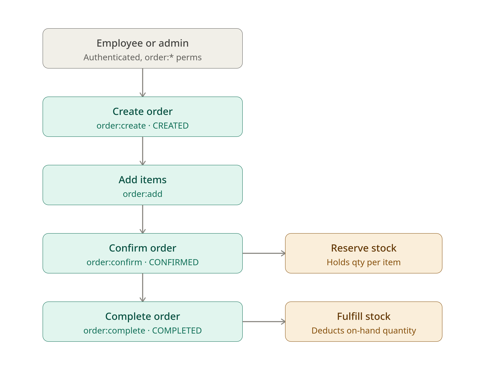
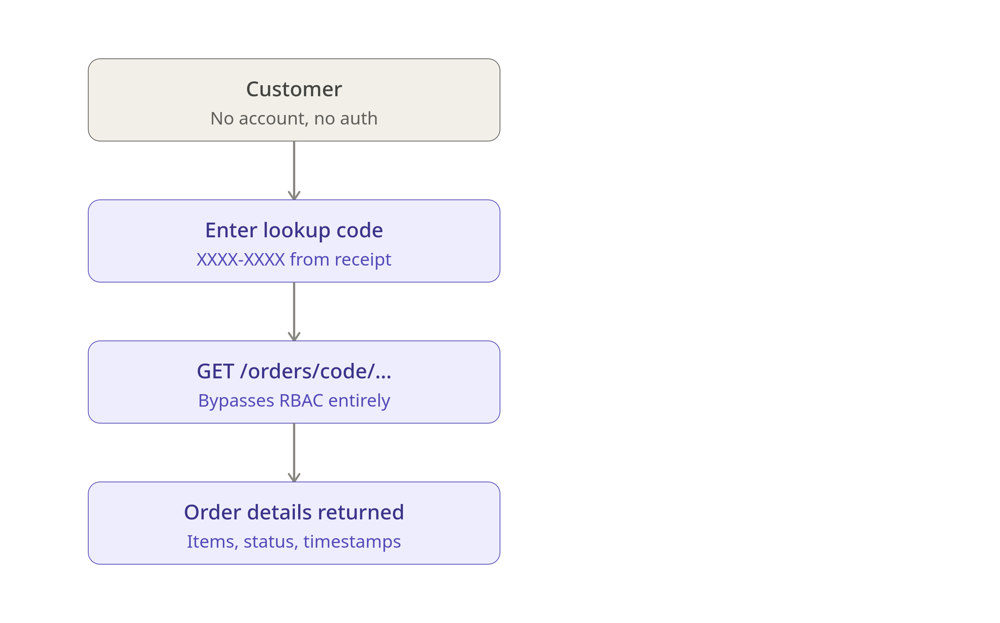

# Management API

Inventory management system for orders, reservations, authentication, and role-permission for administrators, employees, and customers. Focused on back-office systems for businesses and companies.

---

## Table of Contents

- [Overview](#overview)
- [Technical Features](#technical-features)
  - [Deployment on Amazon Web Services](#deployment-on-amazon-web-services)
- [Tech stack](#tech-stack)
- [Architecture](#architecture)
- [Installation & setup (recommended: Docker)](#installation--setup-recommended-docker)
  - [Prerequisites](#prerequisites)
  - [Clone the repository](#clone-the-repository)
  - [Configuration](#configuration)
  - [Run the application](#run-the-application)
  - [Run bootstrap](#run-bootstrap-to-initialize-system-data-such-as-permissions-and-roles)
  - [Local development (optional, without Docker)](#local-development-optional-without-docker)
- [Migrations](#migrations)
- [Testing](#testing)

--- 

## Overview

Managing inventory, orders, and reservations across disconnected tools leads to stock inconsistencies, fulfillment errors, and poor visibility. As operations scale, these problems compound fast.

**Management API** provides a centralized back-office backend that handles the full lifecycle of inventory and orders in a single system, keeping stock levels, reservations, and order states consistent at all times. Access is governed by a role-based model with three distinct roles — administrators, employees, and customers — ensuring each actor can only do what their role allows.


---


Built on FastAPI with a fully async stack (asyncpg + SQLAlchemy), it's designed for **reliability and performance** as your business grows.

It also keeps users informed through **email notifications**, including low-stock **alerts** so inventory is replenished before it runs out, and password reset links for secure account recovery.

---

## Technical Features

- Async-first architecture
- SQLAlchemy 2.0 (typed, async ORM)
- JWT authentication with token rotation
- Email-based password reset flow
- Role-based access control with configurable roles and permissions via constants
- Integration testing (pytest) against a disposable PostgreSQL container
- Modular structure for incremental growth
- Docker-based development environment
- PostgreSQL as primary datastore

### Deployment on Amazon Web Services

The API runs as a container on **Amazon ECS** (Fargate), behind an Application Load Balancer. A few additional AWS services support it:

- **AWS Secrets Manager** — stores the application's configuration (database URL, secret key, mail/CORS settings) as a single JSON secret. The app loads this bundle at startup via the task's IAM role, so no `.env` and no secrets live in the image or repository.
- **ECS Service Auto Scaling** — scales the number of running tasks up or down based on CPU/memory usage to handle changing load.
- **Amazon SES** — sends transactional email (low-stock alerts and password reset links).

---

## Tech stack

- FastAPI
- SQLAlchemy 2.0 (async)
- PostgreSQL
- Alembic
- Pydantic v2
- PyJWT
- Argon2-CFFI
- Pytest
- Docker & Docker Compose

---

## Architecture

The codebase is organized into self-contained feature modules under `app/`, each
following the same layered layout (router → service → repository → model). Shared
concerns (config, security, constants) live in `core/`, and the SQLAlchemy `Base`
plus session wiring live in `database/`.

```text
app/
├── main.py             # FastAPI application entry point
├── core/               # Shared application components
│   ├── config.py       # Application settings (Pydantic Settings)
│   ├── constants/      # Roles, permissions, and shared constants
│   └── security/       # Password hashing, JWT handling, security utilities
├── database/           # Database engine, session, Base, and ORM configuration
├── auth/               # Authentication and account security
│   └── repositories/
├── users/              # User management
├── rbac/               # Role-Based Access Control (roles and permissions)
│   ├── models/
│   └── repositories/
├── inventory/          # Inventory management (products, stock, locations, reservations)
│   ├── models/
│   ├── repositories/
│   ├── router.py
│   ├── service.py
│   └── schemas.py
├── orders/             # Order management and lifecycle
│   ├── models/
│   ├── repository.py
│   ├── router.py
│   ├── service.py
│   └── schemas.py
├── mail/               # Email delivery (AWS SES)
├── observability/      # Logging, monitoring, and application metrics
└── bootstraps/         # Database seed scripts (roles, permissions, initial data)
```

Supporting top-level directories:

```text
alembic/        # database migrations
docs/           # per-module documentation and screenshots
integration/    # pytest integration suite (conftest fixtures + tests)
```

---

## Installation & setup (recommended: Docker)

### Prerequisites
- Docker
- Docker Compose

### Clone the repository
```bash
git clone https://github.com/MaximoBerth0/Management.git
cd Management
```
### Configuration

There is **no committed `.env`**. Configuration is resolved from environment
variables, with this precedence (highest first):

1. Explicit environment variables
2. **AWS Secrets Manager** — when `AWS_SECRETS_NAME` is set, the app loads that
   secret (a JSON object whose keys match the settings) at startup. This is how
   production is configured; see [`deploy/`](deploy/README.md).
3. An optional local `docker/.env` (gitignored)

For local Docker the compose file ships self-contained defaults, so **no setup
is required** — `docker compose ... up` just works. See
[`env.example`](env.example) for the full list of available settings.

### Run the application
```bash
docker compose -f docker/docker-compose.yml up --build
```

### Run bootstrap (to initialize system data such as 'permissions' and 'roles')
```bash
docker compose -f docker/docker-compose.yml exec api python -m app.bootstraps.seed_all
```
#### The API will be available at:
```bash
http://localhost:8000
```
#### Swagger UI:
```bash
http://localhost:8000/docs
```

### Local development (optional, without Docker)
```bash
python -m venv .venv
source .venv/bin/activate
pip install -e .
uvicorn app.main:app --reload
```
- Note: when running locally, you must provide your own PostgreSQL instance and AWS services (or any other cloud provider)

---

## Migrations

Database schema is managed with **Alembic**.

Migrations are applied **automatically** at container startup by
[`docker/entrypoint.sh`](docker/entrypoint.sh) (`alembic upgrade head`), so a
standard `docker compose ... up` always boots the API against an up-to-date
schema. Set `RUN_MIGRATIONS=false` on tasks that must not migrate.

To run migrations manually inside the running `api` container:

```bash
# apply all pending migrations
docker compose -f docker/docker-compose.yml exec api alembic upgrade head
```

To create a new migration after changing the ORM models:

```bash
# autogenerate a revision from the current models
docker compose -f docker/docker-compose.yml exec api alembic revision --autogenerate -m "describe your change"

# review the generated file under alembic/versions/, then apply it
docker compose -f docker/docker-compose.yml exec api alembic upgrade head
```

Common commands (`downgrade -1`, `history`, `current`) work the same way through
`alembic`.

---

## Testing

Integration tests (pytest) run against a **disposable PostgreSQL container**, so
you must start the test database with Docker before running them.

### Prerequisites
- Docker & Docker Compose

### Run the test suite
```bash
# 1. start the test database
docker compose -f docker/docker-compose-test.yml up -d test-db

# 2. run the integration suite
pytest integration/ -v

# 3. tear the test database down
docker compose -f docker/docker-compose-test.yml down
```

The suite in [`integration/`](integration/) sets its own test environment
variables and builds the schema from the ORM metadata (see
[`integration/conftest.py`](integration/conftest.py)), pointing at the
`test-db` container on `localhost:5432`. Make sure that port is free before
starting it.
